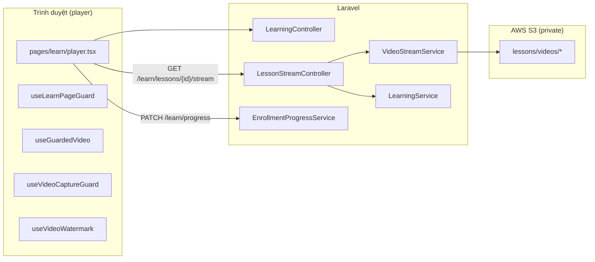

# Bảo mật video học online

Tài liệu tổng hợp các kỹ thuật đã triển khai cho module học video (Phase 4 — Online Learning).

> **Nguyên tắc:** Website (HTML5 player) **không thể** chặn tuyệt đối tải xuống, chụp màn hình hay quay màn hình bằng phần mềm hệ điều hành (OBS, QuickTime, quay màn hình điện thoại…). Mục tiêu thực tế là **làm khó**, **giới hạn phạm vi leak**, và **truy vết** nguồn gốc nếu nội dung bị phát tán.

---

## Kiến trúc tổng quan



---

## 1. Lưu trữ & phân phối video

### 1.1 Bucket S3 private

- Video bài học lưu tại prefix `lessons/videos/*` trên disk `s3` (cấu hình `VIDEO_DISK` / `UPLOAD_DISK`).
- Bucket **không public read** — không có URL tải trực tiếp vĩnh viễn.
- CORS S3 chỉ cho phép domain production (xem hướng dẫn deploy).

**File liên quan:** `config/video.php`, `config/filesystems.php`, `app/Enums/FilePrefix.php`

### 1.2 Không lộ metadata nhạy cảm ra client

- **`video_s3_key` không** được đưa vào Inertia props.
- Client chỉ nhận **`videoStreamUrl`** — URL nội bộ same-origin, ví dụ:
  ```
  GET /learn/lessons/{lesson}/stream
  ```

**File:** `app/Services/Learning/LearningService.php` → `buildPlayerPayload()`

### 1.3 Proxy stream same-origin

Thay vì gửi signed URL S3 xuống trình duyệt, server stream video qua Laravel:

| Thành phần | Vai trò |
|------------|---------|
| `LessonStreamController` | Kiểm tra quyền + chặn truy cập trực tiếp tab mới |
| `VideoStreamService::stream()` | Đọc file từ S3/local, hỗ trợ **HTTP Range** (206 Partial Content) để seek |
| Route `learn.lessons.stream` | Throttle `120 req/phút` |

**Response headers:**

- `Content-Disposition: inline; filename="lesson.bin"` — không gợi ý download
- `Cache-Control: no-store, no-cache, must-revalidate, private`
- `X-Content-Type-Options: nosniff`
- `Accept-Ranges: bytes`

**File:**

- `app/Http/Controllers/Learn/LessonStreamController.php`
- `app/Services/Video/VideoStreamService.php`
- `routes/web.php`

### 1.4 Chặn mở link stream trực tiếp (`Sec-Fetch-Dest`)

Khi user copy URL `/learn/lessons/{id}/stream` và mở tab mới, request thường có `Sec-Fetch-Dest: document` → server trả **403**.

Chỉ cho phép khi request đến từ thẻ `<video>` embed:

- `Sec-Fetch-Dest: video`
- Hoặc `Sec-Fetch-Dest: empty` (một số trình duyệt khi range request)

Trình duyệt cũ không gửi header → cho phép (tương thích test/legacy).

**File:** `LessonStreamController::allowsEmbeddedPlayback()`

### 1.5 Signed URL S3 (chỉ server-side)

`VideoStreamService::signedUrl()` vẫn tồn tại cho mục đích nội bộ/admin nếu cần, nhưng **không** gửi ra player học viên nữa.

TTL mặc định: `VIDEO_SIGNED_URL_TTL=120` phút.

---

## 2. Kiểm soát truy cập (authorization)

### 2.1 Policy xem video

`LearningService::canAccessLesson()` kiểm tra theo thứ tự:

1. Bài học thuộc đúng khóa học và đã publish
2. Admin → luôn được xem
3. **Free preview** (`is_free_preview`) hoặc user có **enrollment active**
4. **Mở khóa tuần tự** — mọi bài trước trong curriculum phải đạt ngưỡng (xem mục 6)

**File:** `app/Services/Learning/LearningService.php`

### 2.2 Stream endpoint

Mỗi request stream đều re-check:

- Course publish
- `canAccessLesson()` (enrollment / preview / sequential)
- Cookie session (user đăng xuất → 403)

**Test:** `tests/Feature/Learn/LearningTest.php` — `enrolled student can stream…`, `user without enrollment cannot stream…`, `lesson stream cannot be opened directly…`

---

## 3. Bảo vệ HTML5 player (client)

**Trang:** `resources/js/pages/learn/player.tsx`

### 3.1 Thuộc tính thẻ `<video>`

```html
controlsList="nodownload noplaybackrate noremoteplayback"
disablePictureInPicture
disableRemotePlayback
playsInline
preload="metadata"
```

| Thuộc tính | Mục đích |
|------------|----------|
| `nodownload` | Ẩn nút tải trên controls (best-effort, phụ thuộc trình duyệt) |
| `noplaybackrate` | Ẩn tùy chọn tốc độ phát trên controls |
| `noremoteplayback` / `disableRemotePlayback` | Chặn cast AirPlay / remote playback |
| `disablePictureInPicture` | Chặn PiP |

### 3.2 Chặn menu chuột phải & kéo thả

- `onContextMenu` → `preventDefault()` trên container và thẻ video
- `select-none` trên shell video
- Chặn `dragstart` trên `<video>` (`useLearnPageGuard`)

### 3.3 Chặn phím tắt DevTools / lưu trang (`useLearnPageGuard`)

Hook: `resources/js/hooks/use-learn-page-guard.ts`

| Phím | Hành vi |
|------|---------|
| `F12` | Chặn |
| `Ctrl/Cmd + Shift + I/J/C/K` | Chặn DevTools |
| `Ctrl/Cmd + U` | Chặn view source |
| `Ctrl/Cmd + S` | Chặn save page |
| `Ctrl/Cmd + P` | Chặn print |
| `Cmd + Option + I/J/C/U` (macOS) | Chặn |

> **Lưu ý:** Nếu user **đã mở DevTools trước** khi vào trang, hook không đóng được DevTools — đây là giới hạn trình duyệt. Proxy stream (mục 1.3) giảm thiệt hại vì không còn lộ URL S3.

---

## 4. Chống tua & phát nhanh

### 4.1 Client — `useGuardedVideo`

**File:** `resources/js/hooks/use-guarded-video.ts`

- Ghi nhận `maxWatched` — thời điểm xa nhất đã xem hợp lệ
- Tua vượt quá `maxWatched + 3 giây` → kéo về vị trí cũ + thông báo
- Sau **3 lần** tua vi phạm → cảnh báo mạnh hơn
- `playbackRate > 1` → reset về `1`
- Resume từ `watched_seconds` khi load lại trang

### 4.2 Server — cap tiến độ heartbeat

**File:** `app/Services/Learning/EnrollmentProgressService.php`

Mỗi lần `PATCH /learn/progress`, server chỉ chấp nhận tăng tối đa:

```
max_progress_advance_seconds = 35  (config/video.php)
```

Client gửi `watched_seconds=500` nhưng DB chỉ tăng thêm tối đa +35s so với giá trị cũ → chống hack qua API.

**Route:** `PATCH /learn/progress` → `ProgressController@update`

---

## 5. Watermark truy vết leak

### 5.1 Mục đích

Nếu video bị quay màn hình và leak, overlay hiển thị **`{Tên} - {email}`** (ví dụ: `Học viên - student@gmail.com`) giúp xác định tài khoản.

### 5.2 Cách hoạt động

**Hook:** `resources/js/hooks/use-video-watermark.ts`  
**UI:** `resources/js/components/learn/video-watermark-overlay.tsx`  
**CSS:** `resources/css/learn-player.css`

| Tham số | Mặc định | Ý nghĩa |
|---------|----------|---------|
| `initial_delay_min` / `max` | 30–75s | Delay trước lần hiện đầu |
| `min_visible` / `max_visible` | 5–10s | Thời gian mỗi lần hiện |
| `min_interval` / `max_interval` | 90–210s | Khoảng cách giữa các lần hiện |

Mỗi lần hiện chọn **ngẫu nhiên 1 trong 4 góc** video.

Chỉ bật khi user **đã đăng nhập** (`watermark.enabled` + có `label`).

Payload backend: `LearningService::watermarkPayload()`

> Watermark là **overlay HTML** trên player — **không burn** vào file video. File tải qua DevTools Network vẫn không có watermark.

---

## 6. Capture guard (chống chụp/quay — best-effort)

**Hook:** `resources/js/hooks/use-video-capture-guard.ts`

| Tính năng | Config | Mô tả |
|-----------|--------|-------|
| Tạm dừng khi ẩn tab | `pause_on_hidden` | `document.hidden` → pause video |
| Chặn phím chụp màn hình | `block_capture_shortcuts` | PrintScreen, Win+Shift+S, Cmd+Shift+3/4/5… |
| Xóa clipboard (Windows) | — | Sau PrintScreen, thử `clipboard.writeText('')` |
| Chặn copy trên vùng video | — | `copy` event trên `<video>` |

Khi phát hiện → pause + notification Mantine.

**Không chặn được:** OBS, quay màn hình iOS/Android, extension, camera quay màn hình vật lý.

---

## 7. Mở khóa bài học tuần tự

Ngăn nhảy bài / xem trước nội dung chưa được phép:

- **`unlock_ratio = 0.8`** — phải xem ≥ 80% **tất cả** bài trước (theo thứ tự curriculum) mới mở bài tiếp theo
- **`completion_ratio = 0.9`** — tự đánh dấu hoàn thành khi xem ≥ 90%
- Nút **「Đánh dấu đã học」** → `POST /learn/lessons/{lesson}/complete` — hoàn thành thủ công, mở bài sau
- Thứ tự bài: `chapter.sort_order` → `lesson.sort_order` → `created_at`
- Navigation prev/next chỉ trỏ **bài liền kề**, không skip bài bị khóa
- Resume (`/learn/{course}`) vào **bài chưa hoàn thành đầu tiên**, không nhảy theo `last_watched_at`

**File:** `app/Services/Learning/LearningService.php`, `EnrollmentProgressService.php`

---

## 8. Heartbeat tiến độ học

| Thông số | Giá trị |
|----------|---------|
| Gửi progress khi tua ≥ 15s | `timeupdate` handler |
| Heartbeat định kỳ | 20 giây (`HEARTBEAT_INTERVAL_MS`) |
| Gửi khi pause / ended | Luôn force gửi |

Tiến độ lưu vào `lesson_progress`, tính `%` khóa qua `EnrollmentProgressService::recalculate()`.

---

## 9. Cấu hình môi trường (`.env`)

```env
# Disk & TTL
VIDEO_DISK=s3
VIDEO_SIGNED_URL_TTL=120

# Tiến độ & mở khóa
# (unlock_ratio, completion_ratio, max_progress_advance_seconds nằm trong config/video.php)

# Watermark
VIDEO_WATERMARK_ENABLED=true
VIDEO_WATERMARK_MIN_INTERVAL=90
VIDEO_WATERMARK_MAX_INTERVAL=210
VIDEO_WATERMARK_MIN_VISIBLE=5
VIDEO_WATERMARK_MAX_VISIBLE=10
VIDEO_WATERMARK_INITIAL_DELAY_MIN=30
VIDEO_WATERMARK_INITIAL_DELAY_MAX=75

# Capture guard
VIDEO_CAPTURE_GUARD_ENABLED=true
VIDEO_CAPTURE_GUARD_PAUSE_ON_HIDDEN=true
VIDEO_CAPTURE_GUARD_BLOCK_SHORTCUTS=true
```

**Config tập trung:** `config/video.php`

---

## 10. Bản đồ file mã nguồn

| Lớp | File |
|-----|------|
| Config | `config/video.php` |
| Stream proxy | `app/Http/Controllers/Learn/LessonStreamController.php` |
| Video service | `app/Services/Video/VideoStreamService.php` |
| Learning logic | `app/Services/Learning/LearningService.php` |
| Progress API | `app/Http/Controllers/Learn/ProgressController.php` |
| Progress service | `app/Services/Learning/EnrollmentProgressService.php` |
| Player UI | `resources/js/pages/learn/player.tsx` |
| Page guard | `resources/js/hooks/use-learn-page-guard.ts` |
| Anti-seek client | `resources/js/hooks/use-guarded-video.ts` |
| Capture guard | `resources/js/hooks/use-video-capture-guard.ts` |
| Watermark | `resources/js/hooks/use-video-watermark.ts`, `resources/js/components/learn/video-watermark-overlay.tsx` |
| Player CSS | `resources/css/learn-player.css` |
| Routes | `routes/web.php` |
| Tests | `tests/Feature/Learn/LearningTest.php` |

---

## 11. Ma trận: kỹ thuật vs mối đe dọa

| Mối đe dọa | Biện pháp | Hiệu quả |
|------------|-----------|----------|
| Copy link S3 từ DevTools | Proxy same-origin, không gửi signed URL | ✅ Cao |
| Mở link stream tab mới | `Sec-Fetch-Dest` + session auth | ✅ Cao |
| Nút Download trên player | `controlsList=nodownload` | ⚠️ Trung bình |
| Chuột phải Save video as | Chặn context menu | ⚠️ Trung bình (DevTools vẫn lưu được) |
| Tua nhanh / skip nội dung | Client + server cap progress | ✅ Cao |
| Xem bài chưa mở khóa | Sequential unlock + auth | ✅ Cao |
| Quay màn hình / OBS | Watermark truy vết | ⚠️ Deterrent, không chặn |
| Chụp màn hình OS | Capture guard phím tắt | ⚠️ Thấp–trung bình |
| DevTools đã mở sẵn | Không chặn được | ❌ Giới hạn web |
| Tải file từ Network tab (cùng session) | Session-bound stream | ⚠️ Vẫn tải được, không watermark trong file |

---

## 12. Hướng nâng cấp (chưa triển khai)

Nếu cần bảo mật cao hơn mức website HTML5:

1. **DRM streaming** (Widevine / FairPlay) — HLS/DASH encrypted
2. **Watermark burn-in server-side** (FFmpeg pipeline khi upload)
3. **App mobile native** với `FLAG_SECURE` (Android) / chặn screenshot iOS (hạn chế)
4. **Forensic watermark** — watermark ẩn per-user trong bitstream
5. **Session token ngắn hạn** cho stream URL, rotate mỗi vài phút qua JS

---

## 13. Tài liệu liên quan

- [phase-4-learning.md](./phases/phase-4-learning.md) — checklist triển khai phase
- [deployment.md](./deployment.md) — cấu hình S3 production
- [architecture.md](./architecture.md) — luồng upload & signed URL (tổng quan)
